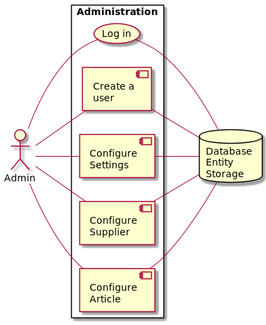
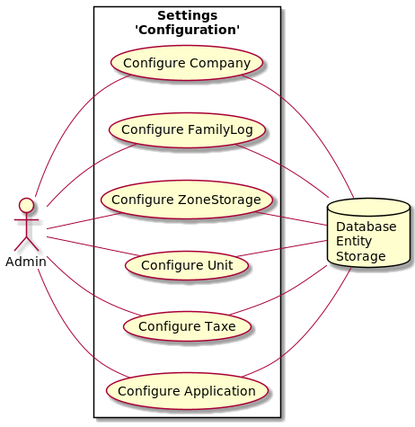
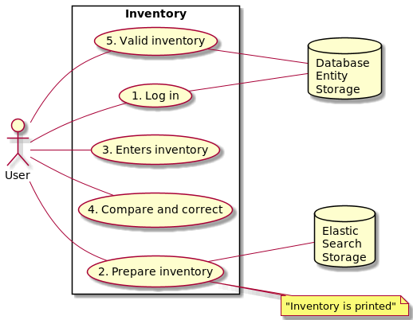
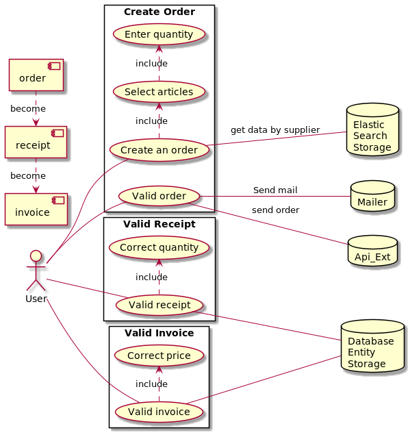

Documentation
=============

## Summary

 - [Models and Entities](models.md)

# Use cases

## list of use cases

### Configure entities (Settings component)

### Inventory management (Inventory Component)

### Order management (Order Component)

