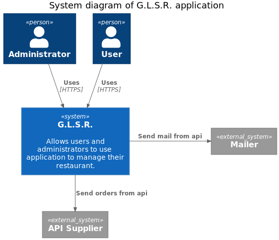
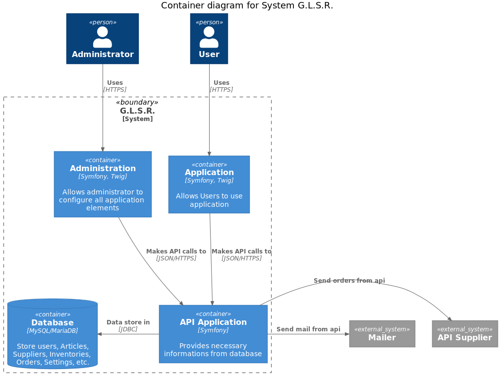
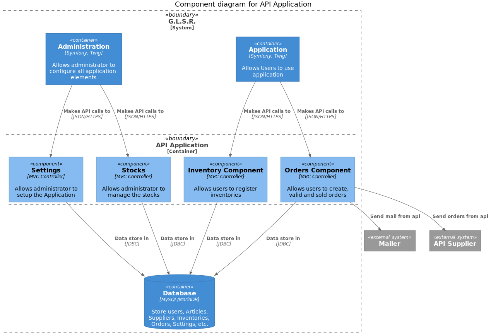
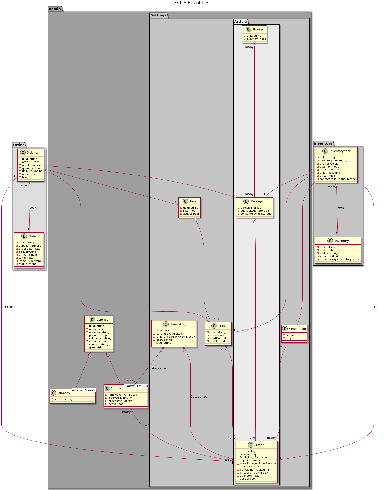

Models
======

**My first vision of the project:** 

After read and study [C4 model](https://c4model.com/) concept, I wrote text that models this vision in three parts.

## System

## Container

## Component

## Entities

I finish with the entities model

[Back to the index](index.md)
